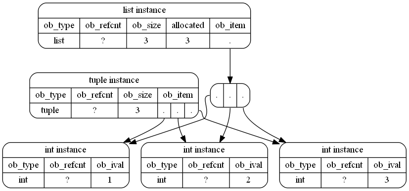

# *Python Data Types*

- Text type: *`str`*
- Numeric types: *`int, float, complex`*
- Sequence types: *`list, tuple, range`*
- Mapping type: *`dict`*
- Set types: *`set, frozenset`*
- Boolean type: *`bool`*
- Binary types: *`bytes, bytearray, memoryview`*

---

1. Do Python have primitive data types ?

> Everything in Python is an object, even int or float,... the obj type is just another 'struct' such as int, dict, so pure python does not have primitive datatype.

2. List and Tuple, which one uses more memory and Why?

> Tuple just store the obj types directly whereas list need an extra layer to store an array of pointers, then that array of pointers point to the obj types.

3. Can a list be inside a set, or a set be inside another set?

> Set can not contain mutable data like list and set.
>
> Set are bases on concept of hash table under the hood which does not store data value in a 'linear index' way, but calculates it hash value then store it data value in the hash value index.
>
> So if we store a mutable data which can be changed, it also mean that its hash value also can be change, and then we must also re-calculate the others elements hash value in that set. In that case, it would become really mess.
>
> If we want to pass collection data into a set, we should convert the data to immutable data like tuple/
> In the case we want to put a set inside another set, we can use frozenset, we can convert each element to be added to a frozen, then add it to the set.

