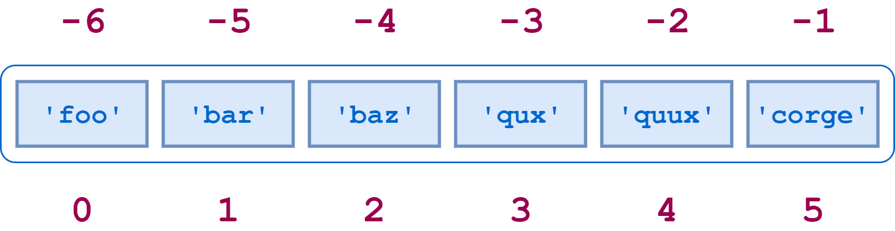

# LIST

The important characteristics:
- Lists are ordered.
- Lists can contain any arbitrary objects.
- List elements can be accessed by index.
- Lists can be nested to arbitrary depth.
- Lists are mutable.
- Lists are dynamic.

---

## List Are Ordered

Lists that have the same elements in a different order are not the same:
```python
>> a = ['foo', 'bar', 'baz', 'qux']
>>> b = ['baz', 'qux', 'bar', 'foo']
>>> a == b
False
>>> a is b
False

>>> [1, 2, 3, 4] == [4, 1, 3, 2]
False
```

---

## List Can Contain Arbitrary Objects

The elements of a list can all be the same type:
```python
a = [2, 4, 6, 8]
```

Or the elements can be of varying types:
```python
a = [21.42, 'foobar', 3, 4, 'bark', False, 3.14159]
```

Lists can even contain complex objects, like functions, classes, and modules:
```python
>>> int
<class 'int'>
>>> len
<built-in function len>
>>> def foo():
...     pass
...
>>> foo
<function foo at 0x035B9030>
>>> import math
>>> math
<module 'math' (built-in)>

>>> a = [int, len, foo, math]
>>> a
[<class 'int'>, <built-in function len>, <function foo at 0x02CA2618>,
<module 'math' (built-in)>]
```

A list can contain any number of objects, from zero to as many as your computer’s memory will allow.    
List objects needn’t be unique. A given object can appear in a list multiple times:
```python
a = [1, 2, 3, 1, 2, 3]
```

---

## List Elements Can Be Accessed By Index

A negative list index counts from the end of the list:



Slicing also works. If a is a list, the expression `a[m:n]` returns the portion of a from index m to, but not including, index n:
```python
>>> a = ['foo', 'bar', 'baz', 'qux', 'quux', 'corge']

>>> a[2:5]
['baz', 'qux', 'quux']
```

Both positive and negative indices can be specified:
```python
>>> a[-5:-2]
['bar', 'baz', 'qux']
>>> a[1:4]
['bar', 'baz', 'qux']
>>> a[-5:-2] == a[1:4]
True
```

Omitting the first index starts the slice at the beginning of the list, and omitting the second index extends the slice to the end of the list:
```python
>>> a = [1, 2, 3, 4]
>>> a[:3]
[1, 2, 3]
>>> a[1:]
[2, 3, 4]
>>> a[:]
[1, 2, 3, 4]
```

You can specify a stride—either positive or negative:
```python
>>> a = [1, 2, 3, 4]
>>> a[0:4:2]
[1, 3]
>>> a[4:0:-2]
[4, 2]
>>> a[::1]
[1, 2, 3, 4]
>>> a[::-1]     # reversing a list
[4, 3, 2, 1]
```

***The `[:]` syntax works for lists. However, there is an important difference between how this operation works with a list and how it works with a string.***  

If s is a string, s[:] returns a reference to the same object:
```python
>>> a = 'hello'
>>> a[:] is a
True
```

Conversely, if a is a list, a[:] returns a new object that is a copy of a:
```python
>>> a = [1, 2, 3]
>>> a[:] is a
False
```

*It’s not an accident that strings and lists behave so similarly. They are both special cases of a more general object type called an iterable*  

By the way, in each example above, the list is always assigned to a variable before an operation is performed on it. But you can operate on a list literal as well:
```python
>>> [1, 2, 3, 4][2]
3

>>> [1, 2, 3, 4][::-1]
[4, 3, 2, 1]

>>> 3 in [1, 2, 3, 4]
True
```

For that matter, you can do likewise with a string literal:
```python
>>> 'Hello'[::-1]
'olleh'
```

---

## Lists Can Be Nested

A list can contain sublists, which in turn can contain sublists themselves, and so on to arbitrary depth:
```python
>>> x = ['a', ['bb', ['ccc', 'ddd'], 'ee', 'ff'], 'g', ['hh', 'ii'], 'j']
```
There is no limit, short of the extent of your computer’s memory, to the depth or complexity with which lists can be nested in this way.  

All the usual syntax regarding indices and slicing applies to sublists as well:
```python
>>> x[1][1][-1]
'ddd'
>>> x[1][1:3]
[['ccc', 'ddd'], 'ee']
>>> x[3][::-1]
['ii', 'hh']
```

---

## Lists Are Mutable

Once a list has been created, elements can be added, deleted, shifted, and moved around at will. Python provides a wide range of ways to modify lists.

### Modifying a Single List Value

A single value in a list can be replaced by indexing and simple assignment:
```python
>>> a = [1, 2, 3, 4]
>>> a[1] = 5
>>> a
[1, 5, 3, 4]
```

A list item can be deleted with the del command:
```python
>>> a = [1, 2, 3, 4]
>>> del a[1]
>>> a
[1, 3, 4]
```

### Modifying Multiple List Values

To change several contiguous elements in a list at one time:
```python
a[m:n] = <iterable>
```

```python
>>> a = ['foo', 'bar', 'baz', 'qux', 'quux', 'corge']

>>> a[1:4]
['bar', 'baz', 'qux']
>>> a[1:4] = [1.1, 2.2, 3.3, 4.4, 5.5]
>>> a
['foo', 1.1, 2.2, 3.3, 4.4, 5.5, 'quux', 'corge']
```

The number of elements inserted need not be equal to the number replaced. Python just grows or shrinks the list as needed.  
You can insert multiple elements in place of a single element—just use a slice that denotes only one element:
```python
>>> a = [1, 2, 3]
>>> a[1:2] = [2.1, 2.2, 2.3]     # using slicing
>>> a
[1, 2.1, 2.2, 2.3, 3]
```

Note that this is not the same as replacing the single element with a list:
```python
>>> a = [1, 2, 3]
>>> a[1] = [2.1, 2.2, 2.3]      # not using slicing
>>> a
[1, [2.1, 2.2, 2.3], 3]
```

You can also insert elements into a list without removing anything. Simply specify a slice of the form `[n:n]` (a zero-length slice) at the desired index:
```python
>>> a = [1, 2, 7, 8]
>>> a[2:2] = [3, 4, 5, 6]      # insert before the index [2:2]
>>> a
[1, 2, 3, 4, 5, 6, 7, 8]
```

You can delete multiple elements out of the middle of a list by assigning the appropriate slice to an empty list. You can also use the del statement with the same slice:
```python
>>> a = ['foo', 'bar', 'baz', 'qux', 'quux', 'corge']
>>> a[1:5] = []
>>> a
['foo', 'corge']

>>> a = ['foo', 'bar', 'baz', 'qux', 'quux', 'corge']
>>> del a[1:5]
>>> a
['foo', 'corge']
```

### Preparing or Appending Items to a List

Additional items can be added to the start or end of a list using the + concatenation operator or the += augmented assignment operator:
```python
>>> a = ['foo', 'bar', 'baz', 'qux', 'quux', 'corge']

>>> a += ['grault', 'garply']
>>> a
['foo', 'bar', 'baz', 'qux', 'quux', 'corge', 'grault', 'garply']

>>> a = ['foo', 'bar', 'baz', 'qux', 'quux', 'corge']

>>> a = [10, 20] + a
>>> a
[10, 20, 'foo', 'bar', 'baz', 'qux', 'quux', 'corge']
```

Note that a list must be concatenated with an object that is iterable, so if you want to add only one element, you need to specify it as a singleton list:
```python
>>> a = ['foo', 'bar', 'baz', 'qux', 'quux', 'corge']
>>> a += 20
Traceback (most recent call last):
  File "<pyshell#58>", line 1, in <module>
    a += 20
TypeError: 'int' object is not iterable

>>> a += [20]
>>> a
['foo', 'bar', 'baz', 'qux', 'quux', 'corge', 20]
```

Strings are iterable also. But watch what happens when you concatenate a string onto a list:
```python
>>> a = ['foo', 'bar', 'baz', 'qux', 'quux']
>>> a += 'corge'
>>> a
['foo', 'bar', 'baz', 'qux', 'quux', 'c', 'o', 'r', 'g', 'e']
```

If you really want to add just the single string 'corge' to the end of the list, you need to specify it as a singleton list:
```python
>>> a = ['foo', 'bar', 'baz', 'qux', 'quux']
>>> a += ['corge']
>>> a
['foo', 'bar', 'baz', 'qux', 'quux', 'corge']
```

### Methods That Modify a List

Because lists are mutable, the list methods shown here modify the target list in place.

#### ***a.append(\<obj>)***

> Appends an object to a list.

Remember, list methods modify the target list in place. They do not return a new list:
```python
>>> a = [1,2,3,4]
>>> id(a)
140286936967296
>>> a.append(5)
>>> id(a)
140286936967296
```

Remember that when the + operator is used to concatenate to a list, if the target operand is an iterable, then its elements are broken out and appended to the list individually:
```python
>>> a = ['a', 'b']
>>> a + [1, 2, 3]
['a', 'b', 1, 2, 3]
```

The .append() method does not work that way! If an iterable is appended to a list with .append(), it is added as a single object:
```python
>>> a = ['a', 'b']
>>> a.append([1, 2, 3])
>>> a
['a', 'b', [1, 2, 3]]
```

Thus, with .append(), you can append a string as a single entity:
```python
>>> a = ['a', 'b']
>>> a.append('foo')
>>> a
['a', 'b', 'foo']
```

#### ***a.append(\<obj>)***

> Extends a list with the objects from an iterable.

The `.extend()` also adds to the end of a list, but the argument is expected to be an iterable. The items in \<iterable> are added individually:
```python
>>> a = ['a', 'b']
>>> a.extend([1, 2, 3])
>>> a
['a', 'b', 1, 2, 3]
```

In other words, `.extend()` behaves like the + operator. More precisely, since it modifies the list in place, it behaves like the += operator:
```python
>>> a = ['a', 'b']
>>> a += [1, 2, 3]
>>> a
['a', 'b', 1, 2, 3]
```

#### ***a.insert(\<index>, \<obj>)***

> Inserts an object into a list.

`a.insert(<index>, <obj>)` inserts object \<obj> into list a at the specified \<index>. Following the method call, `a[<index>]` is \<obj>, and the remaining list elements are pushed to the right:
```python
>>> a = ['foo', 'bar', 'baz', 'qux', 'quux', 'corge']
>>> a.insert(3, 3.14159)
>>> a[3]
3.14159
>>> a
['foo', 'bar', 'baz', 3.14159, 'qux', 'quux', 'corge']
```

#### ***a.remove(\<obj>)***

> Removes an object from a list.

a.remove(<obj>) removes object <obj> from list a. If <obj> isn’t in a, an exception is raised:
```python
>>> a = ['foo', 'bar', 'baz', 'qux', 'quux', 'corge']
>>> a.remove('baz')
>>> a
['foo', 'bar', 'qux', 'quux', 'corge']

>>> a.remove('Bark!')
Traceback (most recent call last):
  File "<pyshell#13>", line 1, in <module>
    a.remove('Bark!')
ValueError: list.remove(x): x not in list
```

#### ***a.pop(index=-1)***

> Removes an element from a list.

This method differs from .remove() in two ways:

1. You specify the index of the item to remove, rather than the object itself.
2. The method returns a value: the item that was removed.

`a.pop()` simply removes the last item in the list:
```python
>>> a = ['foo', 'bar', 'baz', 'qux', 'quux', 'corge']

>>> a.pop()
'corge'
>>> a
['foo', 'bar', 'baz', 'qux', 'quux']
```

---

## Lists Are Dynamic

When items are added to a list, it grows as needed.  
Similarly, a list shrinks to accommodate the removal of items:
```python
>>> a = ['foo', 'bar', 'baz', 'qux', 'quux', 'corge']
>>> a[2:3] = []
>>> del a[0]
>>> a
['bar', 'qux', 'quux', 'corge']
```

## LIST COMPREHENSION

List comprehension offers a shorter syntax when you want to create a new list based on the values of an existing list.

Example:

Based on a list of fruits, you want a new list, containing only the fruits with the letter "a" in the name.

Without list comprehension you will have to write a for statement with a conditional test inside:
```python
fruits = ["apple", "banana", "cherry", "kiwi", "mango"]
newlist = []

for x in fruits:
  if "a" in x:
    newlist.append(x)
```

With list comprehension you can do all that with only one line of code:
```python
fruits = ["apple", "banana", "cherry", "kiwi", "mango"]

newlist = [x for x in fruits if "a" in x]
```