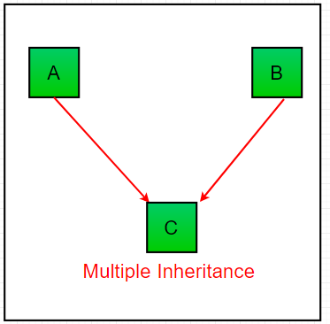
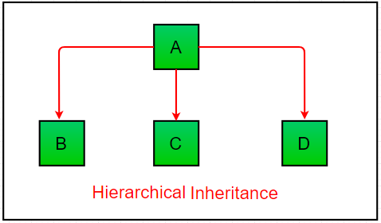

# Class

## How to Define a Class

```python
class Dog:
    pass
```

The properties that all Dog objects must have are defined in a **Constructors** method called `.__init__()`. Every time a new Dog object is created, `.__init__()` sets the initial state of the object by assigning the values of the object’s properties. That is, `.__init__()` initializes each new instance of the class.

You can give `.__init__()` any number of parameters, but the first parameter will always be a variable called `self`. When a new class instance is created, the instance is automatically passed to the `self` parameter in `.__init__()` so that new attributes can be defined on the object.
Let’s update the Dog class with an `.__init__()` method that creates `.name` and `.age` attributes:
```python
class Dog:
    def __init__(self, name, age):
        self.name = name
        self.age = age
```

Attributes created in `.__init__()` are called instance attributes. An instance attribute’s value is specific to a particular instance of the class. All Dog objects have a name and an age, but the values for the name and age attributes will vary depending on the Dog instance.

On the other hand, class attributes are attributes that have the same value for all class instances. You can define a class attribute by assigning a value to a variable name outside of `.__init__()`.

On the other hand, class attributes are attributes that have the same value for all class instances. You can define a class attribute by assigning a value to a variable name outside of `.__init__()`.

For example, the following Dog class has a class attribute called species with the value "Canis familiaris":
```python
class Dog:
    # Class attribute
    species = "Canis familiaris"

    def __init__(self, name, age):
        self.name = name
        self.age = age
```
Class attributes are defined directly beneath the first line of the class name. They must always be assigned an initial value. When an instance of the class is created, class attributes are automatically created and assigned to their initial values.

Use class attributes to define properties that should have the same value for every class instance. Use instance attributes for properties that vary from one instance to another.

---

## Class and Instance Attributes

> *All variables which are assigned a value in the class declaration are class/static variables. And variables that are assigned values inside methods are instance/non-static variables.*

Now create a new Dog class with a class attribute called `.species` and two instance attributes called `.name` and `.age`:
```python
>>> class Dog:
...     species = "Canis familiaris"    # class/static variable
...     def __init__(self, name, age):
...         self.name = name            # instance/non-static variable
...         self.age = age              # instance/non-static variable
```

To instantiate objects of this Dog class, you need to provide values for the `name` and `age`. If you don’t, then Python raises a `TypeError`:
```python
>>> Dog()
Traceback (most recent call last):
  File "<pyshell#6>", line 1, in <module>
    Dog()
TypeError: __init__() missing 2 required positional arguments: 'name' and 'age'
```

To pass arguments to the name and age parameters, put values into the parentheses after the class name:
```python
>>> buddy = Dog("Buddy", 9)
>>> miles = Dog("Miles", 4)
```

After you create the Dog instances, you can access their instance attributes using dot notation:
```python
>>> buddy.name
'Buddy'
>>> buddy.age
9
>>> buddy.species
'Canis familiaris'

>>> miles.name
'Miles'
>>> miles.age
4
````

The key takeaway here is that custom objects are mutable by default. An object is mutable if it can be altered dynamically
```python
>>> buddy.age = 10
>>> buddy.age
10

>>> miles.species = "Felis silvestris"
>>> miles.species
'Felis silvestris'
```

---

## Instance Methods

Instance methods are functions that are defined inside a class and can only be called from an instance of that class. Just like `.__init__()`, an instance method’s first parameter is always `self`.
```python
class Dog:
    species = "Canis familiaris"

    def __init__(self, name, age):
        self.name = name
        self.age = age

    # Instance method
    def description(self):
        return f"{self.name} is {self.age} years old"

    # Another instance method
    def speak(self, sound):
        return f"{self.name} says {sound}"
```

When writing your own classes, it’s a good idea to have a method that returns a string containing useful information about an instance of the class. However, `.description()` isn’t the most Pythonic way of doing this.

Let’s see what happens when you print() the miles object:
```python
>>> print(miles)
<__main__.Dog object at 0x00aeff70>
```

When you `print(miles)`, you get a cryptic looking message telling you that miles is a Dog object at the memory address `0x00aeff70`. This message isn’t very helpful. You can change what gets printed by defining a special instance method called `.__str__()`.
```python
class Dog:
    # Leave other parts of Dog class as-is

    # Replace .description() with __str__()
    def __str__(self):
        return f"{self.name} is {self.age} years old"
```

Now, when you print(miles), you get a much friendlier output:
```python
>>> miles = Dog("Miles", 4)
>>> print(miles)
'Miles is 4 years old'
```

---

## Inherit From Other Classes in Python

Inheritance is the process by which one class takes on the attributes and methods of another. Newly formed classes are called **child classes**, and the classes that child classes are derived from are called **parent classes**.

You may have inherited your hair color from your mother. It’s an attribute you were born with. Let’s say you decide to color your hair purple. Assuming your mother doesn’t have purple hair, you’ve just **overridden (Polymorphism)** the hair color attribute that you inherited from your mom.

You also inherit, in a sense, your language from your parents. If your parents speak English, then you’ll also speak English. Now imagine you decide to learn a second language, like German. In this case you’ve **extended** your attributes because you’ve added an attribute that your **parents don’t have**.

### Parent Classes vs Child Classes

For reference, here’s the full definition of the Dog class:
```python
class Dog:
    species = "Canis familiaris"

    def __init__(self, name, age):
        self.name = name
        self.age = age

    def __str__(self):
        return f"{self.name} is {self.age} years old"

    def speak(self, sound):
        return f"{self.name} says {sound}"
```

To create a child class, you create new class with its own name and then put the name of the parent class in parentheses.
```python
class JackRussellTerrier(Dog):
    pass

class Dachshund(Dog):
    pass

class Bulldog(Dog):
    pass
```

With the child classes defined, you can now instantiate some dogs of specific breeds:
```python
>>> miles = JackRussellTerrier("Miles", 4)
>>> buddy = Dachshund("Buddy", 9)
>>> jack = Bulldog("Jack", 3)
>>> jim = Bulldog("Jim", 5)
```

Instances of child classes inherit all of the attributes and methods of the parent class:
```python
>>> miles.species
'Canis familiaris'

>>> buddy.name
'Buddy'

>>> print(jack)
Jack is 3 years old

>>> jim.speak("Woof")
'Jim says Woof'
```

To determine which class a given object belongs to, you can use the built-in `type()`:
```python
>>> type(miles)
<class '__main__.JackRussellTerrier'>
```

What if you want to determine if miles is also an instance of the Dog class? You can do this with the built-in `isinstance()`:
```python
>>> isinstance(miles, Dog)
True
```

The miles, buddy, jack, and jim objects are all Dog instances, but miles is not a Bulldog instance, and jack is not a Dachshund instance:
```python
>>> isinstance(miles, Bulldog)
False

>>> isinstance(jack, Dachshund)
False
```
More generally, all objects created from a child class are instances of the parent class, although they may not be instances of other child classes.

### Extend the Functionality of a Parent Class

To override a method defined on the parent class, you define a method with the same name on the child class. Here’s what that looks like for the `JackRussellTerrier` class:
```python
class JackRussellTerrier(Dog):
    def speak(self, sound="Arf"):
        return f"{self.name} says {sound}"
```

One thing to keep in mind about class inheritance is that changes to the parent class automatically propagate to child classes. This occurs as long as the attribute or method being changed isn’t overridden in the child class.

For example, change the string returned by `.speak()` in the Dog class:
```python
class Dog:
    # Leave other attributes and methods as they are

    # Change the string returned by .speak()
    def speak(self, sound):
        return f"{self.name} barks: {sound}"
```

Now, when you create a new Bulldog instance named `jim`, `jim.speak()` returns the new string:
```python
>>> jim = Bulldog("Jim", 5)
>>> jim.speak("Woof")
'Jim barks: Woof'
```

However, calling `.speak()` on a `JackRussellTerrier` instance won’t show the new style of output:
```python
>>> miles = JackRussellTerrier("Miles", 4)
>>> miles.speak()
'Miles says Arf'
```

Sometimes it makes sense to completely override a method from a parent class. But in this instance, we don’t want the `JackRussellTerrier` class to lose any changes that might be made to the formatting of the output string of `Dog.speak()`.

You can access the parent class from inside a method of a child class by using `super()`:
```python
class JackRussellTerrier(Dog):
    def speak(self, sound="Arf"):
        return super().speak(sound)
```

When you call `super().speak(sound)` inside `JackRussellTerrier`, Python searches the parent class, `Dog`, for a `.speak()` method and calls it with the variable sound.
```python
>>> miles = JackRussellTerrier("Miles", 4)
>>> miles.speak()
'Miles barks: Arf'
```

### Private members of parent class 

We don’t always want the instance variables of the parent class to be inherited by the child class i.e. we can make some of the instance variables of the parent class private, which won’t be available to the child class.

We can make an instance variable by adding double underscores before its name:
```python
# Python program to demonstrate private members
# of the parent class
class C(object):
       def __init__(self):
              self.c = 21
 
              # d is private instance variable
              self.__d = 42   
class D(C):
       def __init__(self):
              self.e = 84
              C.__init__(self)
```

Since ‘d’ is made private by those underscores, it is not available to the child class ‘D’ and hence the error.
```python
>>> object1 = D()
 
# produces an error as d is private instance variable
>>> object1.d
  File "/home/993bb61c3e76cda5bb67bd9ea05956a1.py", line 1, in 
    object1.d
AttributeError: type object 'D' has no attribute 'd'
```

---

## Types of Inheritance in Python

Types of Inheritance depends upon the number of child and parent classes involved. There are four types of inheritance in Python:

### Single Inheritance


```python
# Python program to demonstrate
# single inheritance


# Base class
class Parent:
	def func1(self):
		print("This function is in parent class.")

# Derived class
class Child(Parent):
	def func2(self):
		print("This function is in child class.")

# Driver's code
object = Child()
object.func1()
object.func2()
```

### Multiple Inheritance

In multiple inheritance, all the features of the base classes are inherited into the derived class.



```python
# Python program to demonstrate
# multiple inheritance


# Base class1
class Mother:
	mothername = ""
	def mother(self):
		print(self.mothername)

# Base class2
class Father:
	fathername = ""
	def father(self):
		print(self.fathername)

# Derived class
class Son(Mother, Father):
	def parents(self):
		print("Father :", self.fathername)
		print("Mother :", self.mothername)
```

### Multilevel Inheritance


```python
# Python program to demonstrate
# multilevel inheritance

# Base class
class Grandfather:

	def __init__(self, grandfathername):
		self.grandfathername = grandfathername

# Intermediate class
class Father(Grandfather):
	def __init__(self, fathername, grandfathername):
		self.fathername = fathername

		# invoking constructor of Grandfather class
		Grandfather.__init__(self, grandfathername)

# Derived class
class Son(Father):
	def __init__(self,sonname, fathername, grandfathername):
		self.sonname = sonname

		# invoking constructor of Father class
		Father.__init__(self, fathername, grandfathername)

	def print_name(self):
		print('Grandfather name :', self.grandfathername)
		print("Father name :", self.fathername)
		print("Son name :", self.sonname)
```

### Hierarchical Inheritance



```python
# Python program to demonstrate
# Hierarchical inheritance

# Base class
class Parent:
	def func1(self):
		print("This function is in parent class.")

# Derived class1
class Child1(Parent):
	def func2(self):
		print("This function is in child 1.")

# Derivied class2
class Child2(Parent):
	def func3(self):
		print("This function is in child 2.")
```

### Hybrid Inheritance

Inheritance consisting of multiple types of inheritance is called hybrid inheritance.
```python
# Python program to demonstrate
# hybrid inheritance

class School:
	def func1(self):
		print("This function is in school.")

class Student1(School):
	def func2(self):
		print("This function is in student 1. ")

class Student2(School):
	def func3(self):
		print("This function is in student 2.")

class Student3(Student1, School):
	def func4(self):
		print("This function is in student 3.")
```